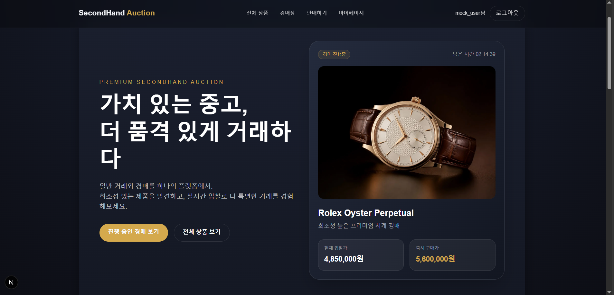
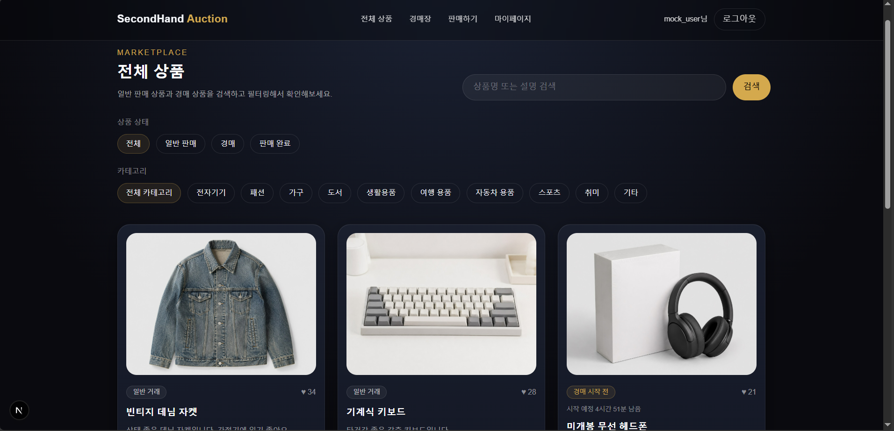
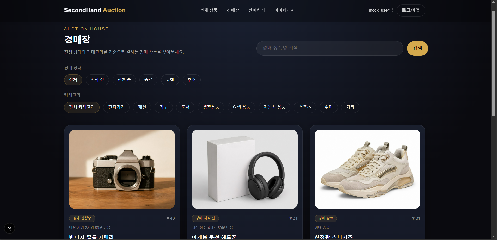
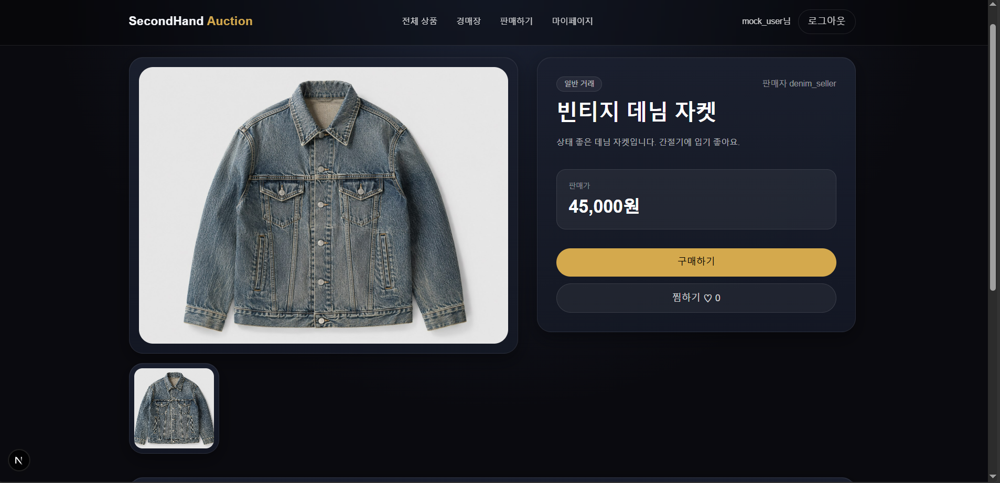
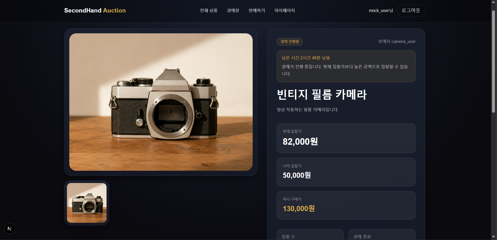
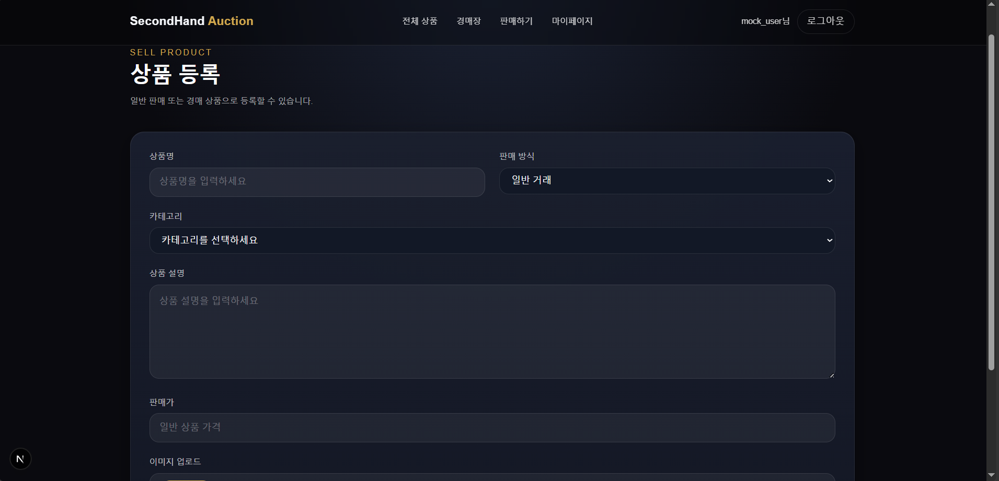
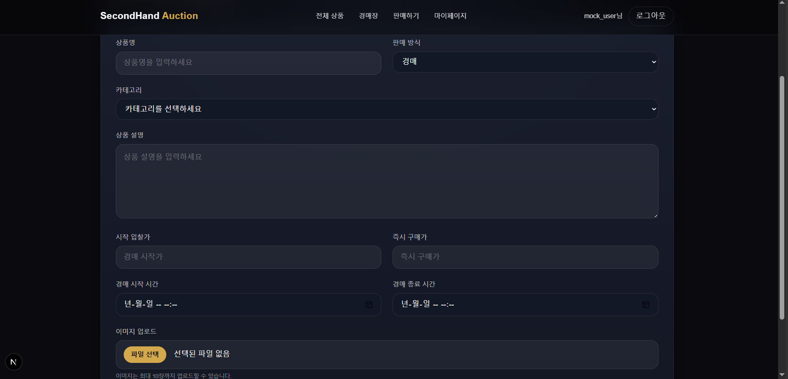
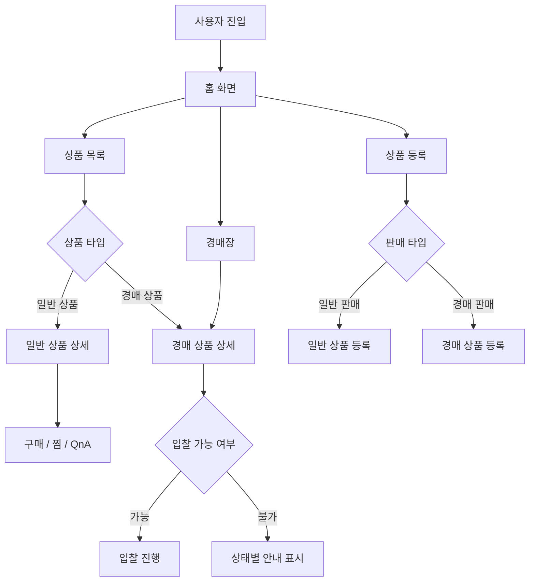
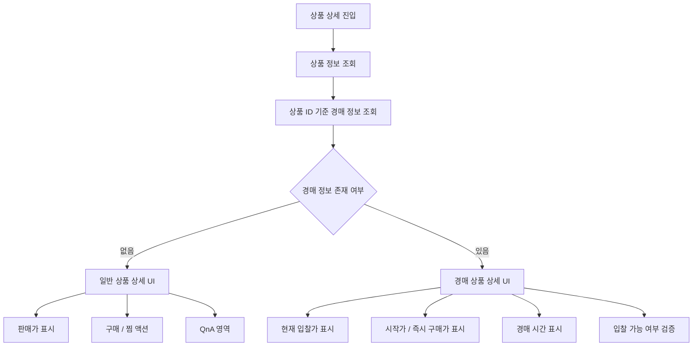
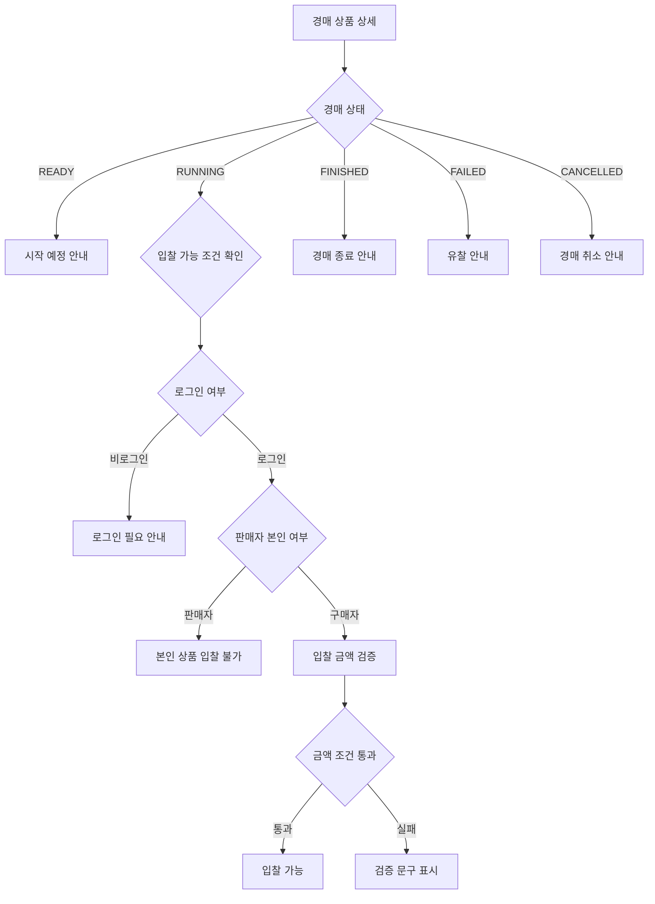

# 🛍️ SecondHand Platform Frontend

일반 중고거래와 경매 거래를 함께 다루는 중고거래 플랫폼 프론트엔드 프로젝트입니다.

상품 조회, 상품 등록, 입찰, 찜, QnA, 마이페이지처럼 거래 전후에 필요한 사용자 흐름을 구현했습니다.

이 프로젝트에서는 일반 판매 상품과 경매 상품이 같은 상품 도메인 안에 있을 때 필요한 화면 분기, 경매 상태 처리, 입찰 가능 여부 판단, 판매 방식별 등록 폼 분기, API 요청 구조 분리를 중점적으로 다뤘습니다.

상품 목록, 상품 상세, 경매장, 경매 상세 화면은 mock 데이터로 단독 확인할 수 있고, 로그인, 상품 등록, 입찰, 찜, QnA, 마이페이지 기능은 실제 백엔드 API 연동 구조를 기준으로 구현했습니다.

---

## 🧰 Tech Stack

| 구분 | 기술 |
| --- | --- |
| Framework | Next.js |
| Language | TypeScript |
| Styling | Tailwind CSS / Global CSS |
| Routing | Next.js App Router |
| API | Fetch 기반 API Client, Service Layer |
| Auth | JWT Access Token / sessionStorage |
| Test | Vitest / Testing Library / jsdom |
| Image | 상품 이미지 업로드 정책 고려 |
| Build | Next.js |

---

## 📌 구현 범위

| 구분 | 설명 |
| --- | --- |
| Mock 데이터로 단독 확인 가능 | 홈, 상품 목록, 상품 상세, 경매장, 경매 상세 |
| API 연동 구조 구현 | 로그인, 회원가입, 상품 등록/수정/삭제, 입찰, 찜, QnA, 마이페이지 |
| 핵심 구현 포인트 | 일반 거래/경매 거래 분기, 경매 상태 처리, 입찰 가능 여부 검증, 판매 방식별 등록 폼 분기, service layer 기반 API 분리 |

### Mock 데이터로 확인 가능한 기능

- 홈 화면
- 상품 목록 조회
- 상품 검색 / 카테고리 / 상태 필터
- 일반 상품 상세 조회
- 경매장 조회
- 경매 상태 필터
- 경매 상품 상세 조회
- 일반 상품 / 경매 상품 카드 구분
- 경매 상태별 안내 문구 확인

### 실제 API 연동이 필요한 기능

- 회원가입 / 로그인
- 상품 등록 / 수정 / 삭제
- 입찰 요청
- 경매 취소
- 찜 등록 / 해제
- QnA 등록 / 답변 / 조회
- 마이페이지 데이터 조회
- 내 등록 상품 / 내 입찰 목록 / 내 찜 목록 / 내 QnA 조회

---

## ✨ 주요 기능

### 👤 사용자 기능

- 회원가입 / 로그인
- 전체 상품 조회
- 일반 상품 상세 조회
- 경매 상품 상세 조회
- 상품 등록
- 일반 거래 / 경매 거래 선택 등록
- 입찰
- 찜
- QnA
- 마이페이지
  - 내 등록 상품
  - 내 입찰 목록
  - 내 찜 목록
  - 내 QnA

### 📦 상품 기능

- 상품 수정
- 상품 삭제
- 상품 상태 표시
- 상품 이미지 표시
- 검색 / 카테고리 / 상태 필터
- 상품 카드 찜 수 표시
- 일반 상품 / 경매 상품 카드 구분
- 경매 상품 남은 시간 표시

### 🔨 경매 기능

- 경매 시작가 / 현재가 / 즉시 구매가 표시
- 경매 시작일 / 종료일 표시
- 경매 상태별 UI 처리
- 입찰 가능 여부 검증
- 최고 입찰가 기준 입찰 금액 검증
- 판매자 본인 입찰 방지
- 경매 상태에 따른 버튼 / 안내 문구 분기

---

## 🖼️ 주요 화면

### 🏠 홈



홈 화면에서는 서비스의 핵심 진입점을 제공합니다.

진행 중인 경매 상품을 강조하고, 전체 상품 목록과 경매장으로 이동할 수 있는 흐름을 제공합니다.  
또한 마감 임박 경매와 인기 상품 섹션을 통해 사용자가 일반 거래와 경매 거래를 자연스럽게 탐색할 수 있도록 구성했습니다.

---

### 🧺 상품 목록



상품 목록 화면에서는 일반 판매 상품과 경매 상품을 함께 조회할 수 있습니다.

상품 상태, 카테고리, 키워드 검색 조건을 조합해 원하는 상품을 찾을 수 있도록 구성했고,  
상품 카드에서는 거래 방식, 찜 수, 가격 정보, 경매 상태를 함께 표시하도록 정리했습니다.

---

### ⏱️ 경매장



경매장은 경매 상품만 모아서 탐색할 수 있는 화면입니다.

현재 mock 경매 데이터 기준으로는 경매 상태와 키워드를 중심으로 필터링하며,  
실제 API 연동 시에는 query 생성 구조를 통해 카테고리 조건까지 확장할 수 있도록 구성했습니다.

진행 중 / 시작 전 / 종료 / 유찰 / 취소 상태에 따라 카드의 상태 표시와 안내 문구가 달라지도록 구성했습니다.

---

### 📦 일반 상품 상세



일반 상품 상세 화면에서는 상품 이미지, 판매자 정보, 판매가, 구매 및 찜 액션을 제공합니다.

일반 상품은 고정 가격을 중심으로 화면을 구성하고,  
하단에서는 상품에 대한 QnA를 작성하거나 조회할 수 있도록 흐름을 분리했습니다.

찜과 QnA는 API 요청 구조를 기준으로 구현되어 있어, 실제 저장과 상태 변경은 백엔드 API 연동이 필요합니다.

---

### 🔨 경매 상품 상세



경매 상품 상세 화면에서는 현재 입찰가, 시작 입찰가, 즉시 구매가, 경매 종료 시간과 남은 시간을 표시합니다.

경매가 진행 중일 때만 입찰 폼을 노출하고,  
로그인 여부, 판매자 본인 여부, 경매 상태, 입찰 금액 조건에 따라 입찰 가능 여부가 달라지도록 처리했습니다.

입찰 요청은 실제 API 연동을 기준으로 구현했습니다.

---

### 📝 일반 상품 등록



상품 등록 화면에서는 판매 방식을 선택해 일반 상품 또는 경매 상품을 등록할 수 있습니다.

일반 거래를 선택하면 판매가 입력 필드를 중심으로 폼을 구성하고,  
상품명, 카테고리, 설명, 이미지 업로드 정보를 함께 입력할 수 있도록 했습니다.

등록 폼 UI와 입력값 분기 구조는 구현되어 있으며, 실제 등록 처리는 백엔드 API 연동이 필요합니다.

---

### 🏷️ 경매 상품 등록



경매 상품 등록 화면에서는 일반 상품 등록과 달리 시작 입찰가, 즉시 구매가, 경매 시작 시간, 경매 종료 시간을 입력합니다.

같은 등록 페이지 안에서 판매 방식에 따라 필요한 필드와 검증 기준이 달라지도록 폼 구조를 분기했습니다.

실제 경매 상품 등록과 저장 처리는 백엔드 API 연동이 필요합니다.

---

## 📌 핵심 문제

초기 구현에서는 일반 상품 목록과 경매 상품 목록을 각각 화면에 보여주는 것에 집중했습니다.

하지만 중고거래와 경매 거래를 함께 지원하려면 단순히 목록을 나누는 것보다, 같은 상품 도메인 안에서 일반 상품과 경매 상품을 어떻게 구분하고 보여줄지가 더 중요했습니다.

일반 상품은 고정 가격과 구매 흐름이 중요하고, 경매 상품은 현재 입찰가, 시작가, 즉시 구매가, 경매 시간, 경매 상태, 입찰 가능 여부가 중요했습니다.

특히 상품 상태와 경매 상태가 서로 다르다는 점을 분리해서 다뤄야 했습니다.  
상품은 `SALE`, `AUCTION`, `SOLD`처럼 거래 방식과 판매 완료 여부를 나타내고, 경매는 `READY`, `RUNNING`, `FINISHED`, `FAILED`, `CANCELLED`처럼 시간과 입찰 여부에 따라 달라집니다.

그래서 상품 목록에서는 일반 상품과 경매 상품을 함께 보여주되, 경매장에서는 경매 상품만 따로 볼 수 있도록 화면 흐름을 나누었습니다.

또한 경매 상품은 입찰자가 생긴 이후 가격, 이미지, 시작 시간 등이 바뀌면 거래 신뢰가 깨질 수 있다고 판단했습니다.  
그래서 판매자가 언제 상품을 수정하거나 취소할 수 있는지 상태별 기준을 정리했고, 백엔드 개발자와 API 응답 필드와 정책을 맞추며 진행했습니다.

입찰, 찜, 상품 등록/수정처럼 사용자가 빠르게 반복 클릭할 수 있는 기능에서는 중복 요청이나 화면 상태 불일치가 발생할 수 있습니다.  
이를 줄이기 위해 요청 중 버튼을 비활성화하거나 pending 상태를 표시하고, 서버 응답 이후 최신 상태를 다시 반영하는 흐름을 고려했습니다.

이 프로젝트에서는 상품 타입 분기, 경매 상태 처리, 입찰 정책 분리, 거래 중 수정/취소 정책, pending 처리, API service 계층 분리를 핵심 문제로 잡았습니다.

---

## 🧭 서비스 흐름



---

## 🔁 일반 거래 / 경매 거래 분기

일반 상품과 경매 상품은 같은 상품 도메인에 속하지만, 화면에서 보여줘야 하는 정보와 사용자 액션이 다릅니다.

일반 상품은 고정 가격과 판매 상태를 중심으로 보여주고,  
경매 상품은 현재 입찰가, 시작가, 즉시 구매가, 경매 시간, 경매 상태를 중심으로 보여줍니다.

```tsx
if (auction) {
  return <AuctionDetail product={product} auction={auction} />;
}

return <ProductDetail product={product} />;
```



---

## 🔨 경매 상태 처리

경매 상태는 시간과 입찰 여부를 기준으로 구분합니다.

| 상태 | 의미 | UI 처리 |
| --- | --- | --- |
| `READY` | 시작 시간 이전 | 경매 시작 전, 입찰 불가 |
| `RUNNING` | 시작 ~ 종료 사이 | 경매 진행 중, 입찰 가능 |
| `FINISHED` | 정상 종료 | 경매 종료, 입찰 불가 |
| `FAILED` | 입찰자 없이 종료 | 유찰 표시 |
| `CANCELLED` | 경매 취소 | 취소된 경매 표시 |

```ts
type AuctionStatus = "READY" | "RUNNING" | "FINISHED" | "FAILED" | "CANCELLED";
```

경매 상태에 따라 버튼 활성화 여부와 안내 문구가 달라지도록 처리했습니다.

```ts
function getAuctionStatusLabel(status: AuctionStatus) {
  switch (status) {
    case "READY":
      return "경매 시작 전";
    case "RUNNING":
      return "경매 진행 중";
    case "FINISHED":
      return "경매 종료";
    case "FAILED":
      return "유찰";
    case "CANCELLED":
      return "경매 취소";
    default:
      return "상태 확인 필요";
  }
}
```

---

## 💰 입찰 정책

입찰 가능 여부는 단순히 경매가 진행 중인지 여부만으로 판단하지 않습니다.

다음 조건을 함께 확인합니다.

- 현재 입찰가보다 높은 금액인지 여부
- 즉시 구매가가 있는 경우 즉시 구매가를 초과하지 않는지 여부
- 경매 상태가 `RUNNING`인지 여부
- 로그인한 사용자인지 여부
- 판매자 본인이 아닌지 여부



입찰 금액 검증과 입찰 가능 여부 판단 로직은 `lib/auction-policy.ts`로 분리했습니다.

이를 통해 UI 컴포넌트는 정책 결과만 사용하고, 정책이 변경될 때는 정책 파일과 테스트만 수정할 수 있도록 구성했습니다.

---

## 📝 판매 등록 폼 분기

판매 등록 페이지에서는 일반 상품과 경매 상품을 같은 페이지에서 등록할 수 있습니다.

일반 상품은 고정 가격을 입력하고,  
경매 상품은 시작가, 즉시 구매가, 시작 시간, 종료 시간 등 경매에 필요한 값을 입력합니다.

```text
판매 방식 선택
  ├─ 일반 상품
  │   └─ 판매가 입력
  └─ 경매 상품
      ├─ 시작가 입력
      ├─ 즉시 구매가 입력
      ├─ 경매 시작 시간 입력
      └─ 경매 종료 시간 입력
```

판매 방식에 따라 필요한 입력값과 검증 기준이 다르기 때문에,  
같은 등록 페이지 안에서 폼 구조를 분기했습니다.

등록 화면의 폼 UI와 분기 구조는 프론트에서 확인할 수 있고, 실제 등록 요청은 백엔드 API 연동이 필요합니다.

---

## 🔍 검색 / 필터 처리

상품 목록에서는 검색, 카테고리, 상품 상태 필터를 함께 사용할 수 있도록 구성했고,  
경매장에서는 경매 상태와 키워드 검색을 중심으로 조회 흐름을 구성했습니다.

실제 API 요청에서는 keyword, status, category 값을 query string으로 변환할 수 있도록 공통 query 생성 로직을 분리했습니다.

- 키워드 검색
- 카테고리 필터
- 상품 상태 필터
- 경매 상태 필터

검색어, 카테고리, 상태 조건이 함께 적용될 수 있도록 query 생성 로직을 분리했습니다.

---

## 🧱 API 요청 구조

페이지와 컴포넌트에서 직접 API 요청을 작성하지 않고, 도메인별 service 함수가 공통 API client를 호출하도록 구성했습니다.

```text
Page / Component
        ↓
Service
        ↓
lib/api.ts
        ↓
Backend API
```

`lib/api.ts`는 공통 요청 처리를 담당합니다.

- API base URL 구성
- Authorization Header 구성
- JSON 요청 / 응답 처리
- 인증 실패 응답 처리
- FormData 요청 처리

이 구조를 사용한 이유는 다음과 같습니다.

- API endpoint 변경 시 수정 범위 축소
- 페이지 컴포넌트는 화면 상태와 사용자 액션에 집중
- 도메인별 API 책임 분리
- Swagger 명세와 TypeScript 타입 연결
- 백엔드 응답 구조 변경에 대응하기 쉬운 구조

---

## 🧪 mock 데이터 기반 화면 검증

백엔드 API가 모두 준비되기 전에 프론트엔드 화면을 먼저 확인해야 했기 때문에, 상품 mock 데이터와 경매 mock 데이터를 분리했습니다.

처음에는 화면 안에서 임시 데이터를 직접 넣어 확인했지만, 실제 API로 전환할 때 수정 범위가 커질 수 있다고 판단했습니다.  
그래서 mock 데이터도 실제 API 응답 형태와 최대한 비슷하게 맞추고, service layer에서 mock API와 실제 API를 전환할 수 있도록 구성했습니다.

```env
NEXT_PUBLIC_USE_MOCK_PRODUCTS=true
NEXT_PUBLIC_USE_MOCK_AUCTIONS=true
```

mock 데이터 기준으로 백엔드 없이 확인할 수 있는 화면은 다음과 같습니다.

| 화면 | 경로 | 확인 가능 범위 |
| --- | --- | --- |
| 홈 | `/` | 마감 임박 경매, 인기 상품 섹션 |
| 상품 목록 | `/products` | 상품 카드, 검색, 카테고리/상태 필터 |
| 경매장 | `/auctions` | 경매 카드, 경매 상태 필터, 키워드 검색 |
| 일반 상품 상세 | `/products/1` | 상품 상세 정보, 가격, 판매자 정보 |
| 경매 상품 상세 | `/products/4` | 현재가, 시작가, 즉시 구매가, 경매 상태 문구 |

상품 등록, 입찰, 찜, QnA, 마이페이지는 화면과 API 호출 구조는 구현되어 있지만, 실제 저장/상태 변경은 백엔드 API가 필요합니다.

---

## 🛠️ 거래 신뢰를 위한 수정 / 취소 정책

중고거래는 판매자와 구매자 간의 신뢰가 중요한 서비스입니다.

특히 경매 상품은 입찰자가 존재할 수 있기 때문에, 거래가 진행 중인 상태에서 판매자가 가격, 이미지, 시작 시간 등을 자유롭게 수정하면 입찰자의 판단 기준이 달라질 수 있습니다.

그래서 일반 판매 상품과 경매 상품의 수정 가능 범위를 분리하고, 경매 상품은 상태에 따라 수정 / 취소 가능 조건을 다르게 정리했습니다.

### 상품 수정 정책

```text
일반 판매 상품
- title, description, category, buyNowPrice, images 수정 가능

경매 상품

READY
- title, description, category, startPrice, buyNowPrice,
  auctionStartTime, auctionEndTime, images 수정 가능

RUNNING
- title, description, auctionEndTime 수정 가능
- auctionEndTime은 뒤로만 연장 가능
- startPrice, buyNowPrice, images 수정 불가

FINISHED / FAILED / CANCELLED
- 수정 불가
```

### 경매 취소 정책

```text
READY
- 취소 가능

RUNNING
- 경매 시작 후 1시간 이내 취소 가능
- 1시간 이후 취소 불가

FINISHED / FAILED / CANCELLED
- 취소 불가
```

### pending / 동기화 처리

입찰, 찜, 상품 등록/수정처럼 사용자가 빠르게 여러 번 누를 수 있는 기능은 요청이 겹치면 화면 상태가 꼬일 수 있다고 생각했습니다.

예를 들어 입찰 요청이 끝나기 전에 같은 버튼을 다시 누르면 중복 입찰이 발생할 수 있고, 찜 수나 현재 입찰가처럼 서버와 맞아야 하는 값이 화면에 오래된 상태로 남을 수 있습니다.

그래서 요청 중에는 버튼을 비활성화하거나 pending 문구를 보여주고, 서버 응답 이후에는 최신 데이터를 다시 반영하는 방식으로 정리했습니다.

- 요청 중 버튼 중복 클릭 방지
- 입찰 요청 중 추가 입찰 방지
- 찜 요청 중 중복 토글 방지
- 등록 / 수정 요청 중 중복 제출 방지
- 서버 응답 이후 현재가, 찜 수, 상품 상태 다시 반영
- 실패 시 에러 메시지 표시 후 기존 화면 상태 유지

수정/취소 가능 범위와 동기화 기준은 백엔드 개발자와 함께 정책을 맞추며 정리했습니다.

---

## 🧪 Test

경매 상품은 상태, 로그인 여부, 판매자 여부, 입찰 금액에 따라 입찰 가능 여부가 달라지고,  
검색 / 필터 조건은 API 요청 query string으로 변환되어야 하기 때문에 관련 로직을 별도 유틸 함수로 분리해 테스트했습니다.

### 테스트 대상

- 입찰 금액 검증 로직
  - 0원 이하 금액 입력 제한
  - 현재 입찰가 이하 금액 제한
  - 즉시 구매가 초과 금액 제한
  - 정상 입찰 금액 검증
- 입찰 가능 여부 판단 로직
  - 비로그인 사용자 입찰 제한
  - 판매자 본인 입찰 제한
  - `RUNNING` 상태에서만 입찰 가능
  - `READY` / `FINISHED` 상태 입찰 제한
- 경매 상태별 UI 문구 처리
  - 남은 시간 표시
  - 상태별 안내 문구
  - 상태별 가격 라벨
- 가격 포맷팅 로직
- 검색 / 필터 query 생성 로직

---

## 🧯 Troubleshooting / Lessons Learned

### 1. 일반 상품과 경매 상품을 같은 상품 도메인에서 처리하는 문제

| 항목 | 내용 |
| --- | --- |
| Problem | 일반 상품과 경매 상품은 같은 상품 목록과 상세 페이지를 공유하지만, 화면에서 보여줘야 하는 정보와 액션이 달랐습니다. |
| Cause | 일반 상품은 고정 가격과 구매 흐름이 중요하고, 경매 상품은 현재 입찰가, 시작가, 즉시 구매가, 경매 시간, 경매 상태, 입찰 가능 여부가 중요했습니다. |
| Fix | 상품 상세 진입 시 상품 정보를 먼저 조회하고, 상품 ID 기준으로 경매 정보를 추가 조회했습니다. 경매 정보가 있으면 경매 상세 UI를, 없으면 일반 상품 상세 UI를 렌더링하도록 분기했습니다. |
| Result | 같은 상품 상세 페이지 안에서 일반 거래와 경매 거래를 함께 처리하면서도, 화면 정책은 명확하게 분리할 수 있었습니다. |

### 2. 반복 클릭과 서버 상태 동기화로 인한 UI 불일치 문제

| 항목 | 내용 |
| --- | --- |
| Problem | 입찰, 찜, 상품 등록/수정처럼 사용자가 빠르게 반복 클릭할 수 있는 기능에서 중복 요청이나 화면 상태 불일치가 발생할 수 있었습니다. |
| Cause | 요청이 끝나기 전에 같은 액션이 다시 실행되면 서버 상태와 화면 상태가 서로 달라질 수 있습니다. 특히 입찰가, 찜 수, 상품 상태처럼 서버 응답이 기준이 되어야 하는 값은 화면에 오래된 값이 남을 수 있었습니다. |
| Fix | 요청 중에는 pending 상태를 두어 버튼을 비활성화하고, 서버 응답 이후 최신 데이터를 다시 반영하는 흐름으로 정리했습니다. 또한 거래 중 상품의 수정/취소 가능 범위는 백엔드 개발자와 함께 상태별 기준을 맞췄습니다. |
| Result | 반복 클릭으로 인한 중복 요청 가능성을 줄이고, 입찰가, 찜 수, 상품 상태처럼 서버와 맞아야 하는 값은 응답 이후 다시 맞추는 흐름으로 정리할 수 있었습니다. |

---

## 📁 프로젝트 구조

```text
secondhand-frontend
├─ app
│  ├─ auctions
│  ├─ login
│  ├─ mypage
│  ├─ products
│  ├─ sell
│  ├─ signup
│  ├─ globals.css
│  ├─ layout.tsx
│  └─ page.tsx
│
├─ components
│  ├─ auction
│  ├─ common
│  ├─ home
│  ├─ layout
│  └─ product
│
├─ constants
│  └─ categories.ts
│
├─ docs
│  └─ screens
│     ├─ home.png
│     ├─ products.png
│     ├─ auctions.png
│     ├─ product-detail.png
│     ├─ auction-detail.png
│     ├─ sell-product.png
│     └─ sell-auction.png
│
├─ lib
│  ├─ api.ts
│  ├─ auction-policy.ts
│  ├─ auction-ui.ts
│  ├─ format.ts
│  ├─ product-query.ts
│  └─ storage.ts
│
├─ mocks
│  ├─ auctions.mock.ts
│  └─ products.mock.ts
│
├─ public
│  └─ mock
│     ├─ product-denim.jpg
│     ├─ product-keyboard.jpg
│     ├─ product-headphone.jpg
│     ├─ product-camera.jpg
│     ├─ product-camping.jpg
│     ├─ product-shoes.jpg
│     └─ hero-watch.jpg
│
├─ services
│  ├─ auction.service.ts
│  ├─ auth.service.ts
│  ├─ bid.service.ts
│  ├─ like.service.ts
│  ├─ product.service.ts
│  ├─ qna.service.ts
│  └─ user.service.ts
│
├─ types
│  ├─ auction.ts
│  ├─ auth.ts
│  ├─ bid.ts
│  ├─ like.ts
│  ├─ product.ts
│  ├─ qna.ts
│  └─ user.ts
│
├─ __tests__
│  ├─ auction-policy.test.ts
│  ├─ auction_ui.test.ts
│  ├─ format.test.ts
│  └─ product-query.test.ts
│
├─ .env.example
├─ README.md
├─ package.json
├─ next.config.ts
├─ tsconfig.json
└─ vitest.config.ts
```

---

## 🔧 환경 변수

`.env.example`을 참고해 `.env.local` 파일을 생성합니다.

```env
NEXT_PUBLIC_API_BASE_URL=http://localhost:8080
NEXT_PUBLIC_USE_MOCK_PRODUCTS=true
NEXT_PUBLIC_USE_MOCK_AUCTIONS=true
```

### Mock 데이터로 프론트 화면 확인

```env
NEXT_PUBLIC_API_BASE_URL=http://localhost:8080
NEXT_PUBLIC_USE_MOCK_PRODUCTS=true
NEXT_PUBLIC_USE_MOCK_AUCTIONS=true
```

### 실제 백엔드 API 연동

```env
NEXT_PUBLIC_API_BASE_URL=http://localhost:8080
NEXT_PUBLIC_USE_MOCK_PRODUCTS=false
NEXT_PUBLIC_USE_MOCK_AUCTIONS=false
```

`NEXT_PUBLIC_API_BASE_URL`은 실제 백엔드 API 서버 주소로 변경해서 사용합니다.

---

## 🚀 실행 방법

```bash
npm install
npm run dev
```

---

## 📦 Build

```bash
npm run build
```

---

## 🧪 Test

```bash
npm test
```

또는

```bash
npm run test:run
```